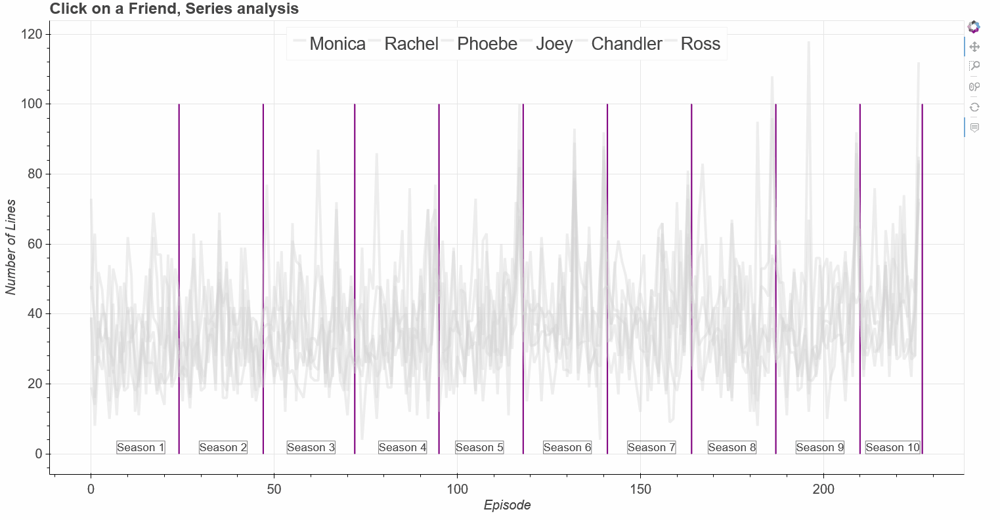

# friends_analysis
Analysing ''Friends'' screenplay

**Python files:**

Friends_analysis.py - Main; Text processing and data extraction;

Plot_friends_analysis.py - WordClouds; 

count_two_words.py - Find phrases;

**Friends_bokeh.py - create interactive plot with bokeh to visualise number of lines throughout the series;**

correlation_plots.py - Statistics with number of lines;

**Jupyter notebooks:**

Sentiment_Phoebes_songs.ipynb - contains collection of Pheobes songs to create wordclouds and performe sentiment analysis

Friends_analysis.ipynb - contains collection of Functions to performe text processing

**Number of lines throughout the series**

